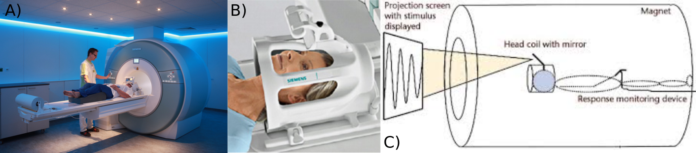

# Brain State Predictions During Approaching and Retreating Threats: An fMRI Study.
==============================

Functional magnetic resonance imaging (fMRI) data, RNN implementation to predict brain states during anticipation of aversive and neutral events.

## Introduction

### What is fMRI data?

- Functional Magnetic Resonance Imaging (fMRI).
- Timeseries data.
- Like a movie of the brain.
- Each frame (timepoint) is a 3D volume.
- Rate at which fMRI data is collected is commonly referred to as repetition time (TR).
- Commonly used TR is 0.5-2 seconds per volume. TR = 1.25 seconds for the current study.

