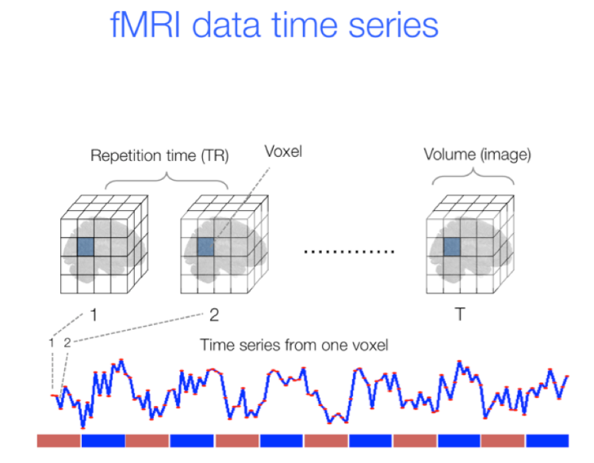

# Decoding Brain Dynamics: Brain Activity Patterns Predict Nature of the Stimulus.

LSTM (GRU) implementation on fMRI timeseries data to predict instances of approaching and retreating threats.

## Requirements

To install requirements:
```setup
pip install -r requirements.txt
```

> CUDA version 10.0.130

Data: Proprietary


# Introduction

Different stimuli evoke different brain response, which enables an organism to respond to a particular stimulus in a particular way. Interesting question about the brain-stimuli relationship is: can the nature of the stimulus be predicted based on the evoked brain activity?

In this project, dynamic brain activity patterns of human subjects captured by fMRI in response to approaching and retreating threats is used to predict the stimulus class (approaching or retreating threat).  

## What is fMRI data?

- Functional Magnetic Resonance Imaging (fMRI) is a timeseries data.
- Like a movie of the brain.
- Each frame is a 3D volume that represents a timepoint.
- Unit of the 3D volume is a voxel (analogous to 2D image pixel).  
- Dimensions of a voxel is generally 3mm x 3mm x 3mm.
- Rate at which fMRI data is collected is commonly referred to as repetition time (TR).
- Commonly employed TR is 0.5-2 seconds per volume. TR = 1.25 seconds for the current study.


(https://psychology.stackexchange.com/questions/19587/what-does-fmri-data-look-like-after-pre-processing)


# Methods

## Procedure & Visual Stimuli
- fMRI data was collected from 61 participants.
- Forty-five minutes of fMRI data was collected on every participant.
- Two circles moved around randomly on the projection screen. 
- When circles collided, a mild but unpleasant electric shock was delivered to the index and middle fingers of participant's left hand. 
- Shock delivery was meant to induce fear of circle collision.
- Several "near-miss" events occured at random times during the experiment. 
- Near-miss events are defined as those when the circles approach each other at least for 8 seconds, come very close (i.e., distance less than 1.5 times the circle diameter), but miss and start to retreat at least for 8 seconds.
- Near-miss events were included to investigate the brain's dynamic response to approaching and retreating threats.

Check out a short clip of the visual stimulus [here](https://youtu.be/RUhoOgjJqlo)

## Data Preprocessing
- fMRI time-series data suffers from a lot of noise such as,
    - Physiological signals associated with respiratory and cardiac cycles.
    - Head motion.
    - Scanner noise (drifts).
- These noise were filtered out using ICA provided FMRIB Software Library [FSL](https://fsl.fmrib.ox.ac.uk/fsl/fslwiki/)


## Tuning, Training & Evaluation
To find best hyperparameters like `L2`, `dropout`, and `learning_rate` for the GRU classifier
using a cross-validation, gri-search approach:

```
python grid_search.py --input-data <path to segments dataset pickle file> \
    --time-point 5 --L2 '0 0.001 0.003 0.01 0.03' --dropout '0 0.1 0.2 0.3 0.4' \
    --learning-rate '0.001 0.003 0.006' --cv <number of folds> \
    --n-models <number of random models to run a randomized grid-search (skip to search the entire grid)> \
    --out-data <declare path and output file name (end with extension '.pkl')>
```

The `grid_search.py` script can be used to find the best combination of `L2`, `dropout`, and `learning_rate` by specifying a range of values for each hyperparameter (as in the above example). It can also be used to simply get a k-fold cross-validation performance for a single combination of hyperparameters. This can be done by specifying single values for every hyperparameter and skipping the `--n-models` option.

---

To train a model using the best hyperparameters and save it:
```
python train_model.py -GSCV <path to the output of grid_search.py> \
    -data <path to segments dataset pickle file> \
    -tp 5 -overwrite <overwrite previous output: 0 (default) or 1> \
    -o <declare path and model name (end with extension '.h5')>
```

---
To get chance chance accuracy distribution:
```
python perm_accuracy.py -data <path to segments dataset pickle file> \
    -tp 5 --best-L2 <float> --best-dropout <float> --best-lerning-rate <float> \
    -k_perms <number of permutations to perform (default is 1000)> \
    -overwrite <overwrite previous output: 0 (default) or 1> \
    --output <declare path and output file name (end with extension '.pkl')>
```


